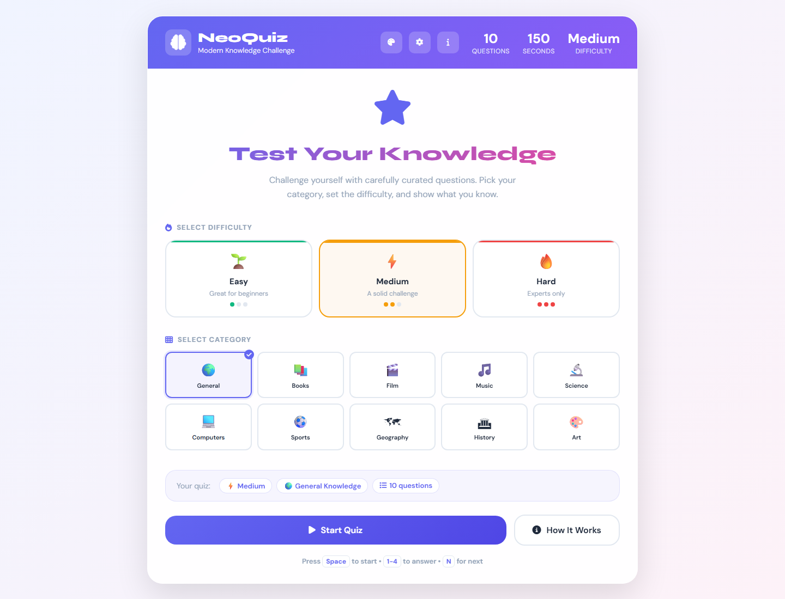

# 🧠 NeoQuiz — Modern Knowledge Challenge


A feature-rich, responsive trivia quiz app built with pure HTML, CSS, and Vanilla JavaScript. Powered by the Open Trivia DB API — no frameworks, no dependencies — just clean, modern code.

---

## 🌐 Live Demo

> [https://neo-quiz-app.netlify.app/](https://neo-quiz-app.netlify.app/)

---

## 📸 Preview

> 

---

## ✨ Features

- **🎯 10 Categories** — General Knowledge, Books, Film, Music, Science, Computers, Sports, Geography, History, and Art
- **🔥 3 Difficulty Levels** — Adaptive API questions per Easy / Medium / Hard level
- **⏱️ Configurable Timer** — Choose 15s, 20s, 30s, 45s per question or disable entirely
- **⌨️ Keyboard Shortcuts** — `1–4` to answer, `Space` / `N` for next, `R` to restart, `Ctrl+T` to cycle themes
- **✅ Instant Feedback** — Correct/wrong highlighting with explanations after every answer
- **📋 Answer Review** — Full ✓/✗ breakdown at the end of every quiz
- **🏆 Performance Messages** — Personalized result messages (90%+ = Quiz Master!)
- **💾 Persistent Settings** — Theme, timer, difficulty, and category saved via `localStorage`
- **📤 Share Results** — Native share sheet or clipboard copy (e.g. "I got 8/10 on Hard History!")
- **🎨 4 Themes** — Default, Dark, High Contrast, and Minimal
- **♿ Accessibility** — ARIA labels, reduced motion support, keyboard focus management
- **⚡ Quick Start** — One-click 5-question Easy quiz from the Settings panel

---

## 🗂️ Project Structure

```
neoquiz/
│
├── index.html       # App layout and markup
├── style.css        # All styles, variables, and responsive design
└── script.js        # Quiz state, API fetching, and full application logic
```

---

## 🚀 Getting Started

No build tools or installations required.

### 1. Clone the repository

```bash
git clone https://github.com/muneebali500/neo-quiz.git
```

### 2. Open in browser

```bash
cd neoquiz
open index.html
```

Or simply double-click `index.html` — it runs entirely in the browser.

> **Note:** Requires an internet connection to fetch questions from the [Open Trivia DB API](https://opentdb.com/).

---

## 🎮 How to Use

| Action               | How                                                    |
| -------------------- | ------------------------------------------------------ |
| Choose difficulty    | Click Easy 🌱 / Medium ⚡ / Hard 🔥 on the home screen |
| Choose category      | Click any of the 10 category cards                     |
| Start quiz           | Click **Start Quiz** or press `Space`                  |
| Select an answer     | Click an option or press `1`, `2`, `3`, or `4`         |
| Go to next question  | Click **Next Question** or press `Space` / `N`         |
| Restart at any time  | Click **Restart** or press `R`                         |
| Change timer         | Open ⚙️ Settings → Timer Options                       |
| Change theme         | Click 🎨 or open ⚙️ Settings → Appearance              |
| Quick 5-question run | Open ⚙️ Settings → **Start Quick Quiz**                |
| Share your score     | Click **Share Results** on the results screen          |
| Close settings/popup | Press `Esc`                                            |

---

## 💻 Key JavaScript Concepts

- **State Management** — Centralized `state` object controls all quiz flow and settings
- **Async Fetch** — Open Trivia DB API with HTML entity decoding and `response_code` error handling
- **setInterval / clearInterval** — Precise per-question countdown timers with warning/danger states
- **Event Delegation** — Keyboard shortcut handler and click-outside detection for panels
- **DOM Manipulation** — Dynamic option rendering, progress bar updates, and results injection
- **localStorage** — Theme, timer, difficulty, and category persist across sessions
- **Array Methods** — `map`, `forEach`, `find`, `filter`, and Fisher-Yates shuffle
- **Error Resilience** — API fallbacks with user-facing error alerts and graceful recovery
- **ES6+** — `const`/`let`, arrow functions, template literals, destructuring, spread operator
- **Performance** — Cached DOM references and batched UI updates

---

## 🎨 Design Highlights

- **Dual-font system** — _DM Sans_ for body text, _Syne_ for headings and score displays
- **CSS Custom Properties** — Full design token system for colors, shadows, radii, and transitions
- **4 Themes** — Default, Dark, High-Contrast, and Minimal via body class switching
- **Micro-interactions** — Option hover lifts, timer pulse animations, and progress bar fills
- **Difficulty color coding** — 🟢 Easy / 🟡 Medium / 🔴 Hard with colored top borders and backgrounds
- **Visual timer feedback** — Neutral → Warning (orange) → Danger (red) color transitions as time runs out
- **Responsive layout** — Category and difficulty grids reflow cleanly from desktop to mobile
- **Accessibility notices** — Slide-in toast messages for keyboard users (auto-dismiss after 3s)
- **Results review** — Color-coded ✓/✗ cards with user answer vs. correct answer comparison

---

## 📦 Dependencies

All loaded via CDN — no `npm install` needed.

| Library                                                    | Purpose    |
| ---------------------------------------------------------- | ---------- |
| [Google Fonts — DM Sans & Syne](https://fonts.google.com/) | Typography |
| [Font Awesome 6.4](https://fontawesome.com/)               | Icons      |
| [Open Trivia DB API](https://opentdb.com/)                 | Questions  |

---

## 🛠️ Possible Improvements

- [ ] Dark mode toggle on the main screen (not just settings)
- [ ] Score leaderboard with `localStorage` high scores
- [ ] Multi-category selection
- [ ] Timed total-quiz mode (single timer for all questions)
- [ ] Sound effects for correct/wrong answers
- [ ] Offline fallback question bank
- [ ] Animated score counter on results screen

---

## 🙌 Acknowledgements

- [Open Trivia DB](https://opentdb.com/) — free, community-sourced trivia API
- [Font Awesome](https://fontawesome.com/) — icon library
- [Google Fonts](https://fonts.google.com/) — typography

---

> Built with ❤️ using pure HTML, CSS & JavaScript — no frameworks needed.
